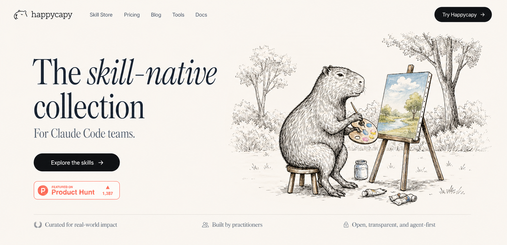

<div align="center">
  <h1>Happycapy Skills</h1>
  <h3>The skill-native collection for Claude Code</h3>
  <p>
    Curated, production-ready skills for coding, design, documents, media, research,
    and automation in <a href="https://happycapy.ai">Happycapy</a> and Claude Code.
  </p>
  <p>
    <a href="#quick-start">Quick Start</a> |
    <a href="#featured-collections">Featured Collections</a> |
    <a href="#featured-skills">Featured Skills</a> |
    <a href="#skill-catalog">Skill Catalog</a> |
    <a href="#pptx-style-systems">PPTX Style Systems</a> |
    <a href="#create-your-own-skill">Create Your Own Skill</a> |
    <a href="#contributing">Contributing</a>
  </p>
  <p>
    
    
    
    
  </p>
</div>

<p align="center">
  
</p>

<p align="center">
  <br/>
  <a href="https://www.producthunt.com/posts/happycapy?utm_source=badge-featured&utm_medium=badge&utm_souce=badge-happycapy" target="_blank"></a>
  <br/>
  <br/>
</p>

<p align="center">
  A curated collection of drop-in Claude Code skills sourced from leading open projects
  and community maintainers. Every skill lives in its own folder, keeps source
  attribution, and is ready to install into <code>~/.claude/skills</code>.
</p>

<p align="center">
  <a href="https://github.com/happycapy-ai/Happycapy-skills">Repository</a> |
  <a href="https://support.claude.com/en/articles/12512176-what-are-skills">What are skills?</a> |
  <a href="https://support.claude.com/en/articles/12512180-using-skills-in-claude">Using skills</a> |
  <a href="https://support.claude.com/en/articles/12512198-creating-custom-skills">Create custom skills</a> |
  <a href="https://github.com/happycapy-ai/Happycapy-skills/issues">Submit a skill</a>
</p>

<p align="center">
  <em>
    Copy one folder, unlock one capability, and keep your agent stack portable.
  </em>
</p>

## Why Happycapy Skills

Happycapy Skills is built for people who want a cleaner way to extend Claude Code without
assembling a toolbox from scratch.

- Curated instead of dumped. Skills are selected because they solve real workflows.
- Drop-in installation. Each skill is a self-contained folder with a `SKILL.md`.
- Broad coverage. The catalog spans app development, design, media, writing, research, and automation.
- Attribution preserved. Original source and license context stay with each skill directory.
- Happycapy-aware additions. Some skills are adapted specifically for Happycapy environments and MCP workflows.

## Featured Collections

| Collection | What you get | Great for |
| --- | --- | --- |
| Agent systems | Multi-agent orchestration, skill discovery, self-improvement, and autonomous contribution workflows | Extending Claude, internal tooling, agent teams |
| App and web development | Next.js, Better Auth, Expo Router, Supabase Postgres, design systems, immersive UI | Shipping apps faster with stronger defaults |
| Design and documents | Slides, PowerPoint, PDFs, LaTeX, storytelling, writing, and prompt refinement | Client deliverables, reports, documentation |
| PPTX style systems | Six fixed-style PowerPoint skills, each locking in a distinct visual identity — from exhibition posters to field guides to forum decks | Branded decks, event materials, product launches |
| Media and creative AI | Image generation, video generation, film workflows, frame extraction, GIF creation | Visual content, prototypes, creative production |
| Social and creator workflows | Reddit, Xiaohongshu, Instagram carousel creation, and multi-platform publishing | Marketing, community growth, recruiting |
| Happycapy integrations | Feishu MCP, utilities, and environment-specific tools | Connected workflows inside Happycapy |

## Quick Start

Clone the repository, then copy the skill folders you want into your Claude skills directory.

```bash
git clone https://github.com/happycapy-ai/Happycapy-skills.git
cd Happycapy-skills

mkdir -p ~/.claude/skills

# Install one skill
cp -r skills/pdf ~/.claude/skills/

# Install a few favorites
cp -r skills/find-skills ~/.claude/skills/
cp -r skills/happycapy-skill-creator ~/.claude/skills/
cp -r skills/frontend-slides ~/.claude/skills/

# Or install everything
cp -r skills/* ~/.claude/skills/
```

Every skill is self-contained. If a skill includes scripts, references, or assets, they stay
inside that skill folder and move with it.

## Featured Skills

| Skill | What it helps with |
| --- | --- |
| [`happycapy-skill-creator`](./skills/happycapy-skill-creator/) | Adapts or builds new skills for Happycapy by reusing proven upstream patterns |
| [`find-skills`](./skills/find-skills/) | Discovers installable skills when users ask, "How do I do X?" |
| [`frontend-slides`](./skills/frontend-slides/) | Creates rich HTML presentations with visual direction and animation |
| [`pdf`](./skills/pdf/) | Handles extraction, OCR, merging, form filling, and PDF generation |
| [`capy-video-gen-skill`](./skills/capy-video-gen-skill/) | Builds multi-shot AI videos with face consistency across scenes |
| [`happycapy-feishu`](./skills/happycapy-feishu/) | Connects Claude to Feishu or Lark workflows through MCP |
| [`claude-code-templates`](./skills/claude-code-templates/) | Adds templates, commands, integrations, and setup workflows for Claude Code |
| [`oss-contributor-swarm`](./skills/oss-contributor-swarm/) | Runs an autonomous open source contribution workflow across GitHub tasks |

## Skill Catalog

The full catalog currently includes **54 skills** across seven collections.

<details>
<summary><strong>Agent Systems and Workflow (8)</strong></summary>

- [`find-skills`](./skills/find-skills/) - Discover installable skills when users ask how to do something.
- [`skill-creator`](./skills/skill-creator/) - Design, structure, and package new Claude skills.
- [`happycapy-skill-creator`](./skills/happycapy-skill-creator/) - Build Happycapy-compatible skills by adapting proven upstream skills.
- [`contract-first-agents`](./skills/contract-first-agents/) - Coordinate multi-agent teams with a contract-first protocol.
- [`oss-contributor-swarm`](./skills/oss-contributor-swarm/) - Run an autonomous open source contribution swarm.
- [`llm-council`](./skills/llm-council/) - Compare and synthesize answers from multiple models side by side.
- [`capy-cortex`](./skills/capy-cortex/) - Add persistent reflection and learning to an assistant workflow.
- [`claude-code-templates`](./skills/claude-code-templates/) - Install templates, commands, hooks, agents, and external integrations.

</details>

<details>
<summary><strong>App, Web, and Product Development (10)</strong></summary>

- [`next-best-practices`](./skills/next-best-practices/) - Apply strong Next.js conventions for modern product teams.
- [`better-auth-best-practices`](./skills/better-auth-best-practices/) - Integrate Better Auth cleanly in TypeScript applications.
- [`building-native-ui`](./skills/building-native-ui/) - Build Expo Router apps with native-feeling foundations.
- [`supabase-postgres-best-practices`](./skills/supabase-postgres-best-practices/) - Improve Postgres design and performance on Supabase.
- [`3d-web-experience`](./skills/3d-web-experience/) - Craft immersive 3D web experiences with modern browser tooling.
- [`mobile-design`](./skills/mobile-design/) - Make better product decisions for iOS and Android interfaces.
- [`mobile-app-developer`](./skills/mobile-app-developer/) - Build full mobile apps with native-quality patterns and cross-platform guidance.
- [`create-design-system-rules`](./skills/create-design-system-rules/) - Generate design system rules for a real codebase from Figma context.
- [`goplaces`](./skills/goplaces/) - Query Google Places through a human-friendly or scriptable CLI.
- [`360-panorama-viewer`](./skills/360-panorama-viewer/) - Build standalone immersive panorama viewers as single HTML files.

</details>

<details>
<summary><strong>Design, Documents, and Presentations (12)</strong></summary>

- [`canvas-design`](./skills/canvas-design/) - Create polished visual pieces in PNG and PDF format.
- [`frontend-slides`](./skills/frontend-slides/) - Produce animation-rich HTML slide decks.
- [`pptx`](./skills/pptx/) - Generate editable, polished PowerPoint presentations.
- [`pdf`](./skills/pdf/) - Read, extract, merge, OCR, fill, and generate PDFs.
- [`latex-document`](./skills/latex-document/) - Produce professional LaTeX documents and PDF outputs.
- [`html-over-markdown`](./skills/html-over-markdown/) - Render rich formatted output as HTML instead of plain markdown.
- [`data-storytelling`](./skills/data-storytelling/) - Turn analysis into narratives that stakeholders can act on.
- [`writing-clearly-and-concisely`](./skills/writing-clearly-and-concisely/) - Strengthen prose for documentation, UI, and reports.
- [`prompt-improver`](./skills/prompt-improver/) - Rewrite vague prompts into specific, usable instructions.
- [`image-enhancer`](./skills/image-enhancer/) - Sharpen, upscale, and clean up screenshots or images.
- [`resume-assistant`](./skills/resume-assistant/) - Support resume writing, interview prep, and job search planning.
- [`treatment-plans`](./skills/treatment-plans/) - Generate concise, structured medical treatment plans.

</details>

<details>
<summary><strong>Media and Creative AI (10)</strong></summary>

- [`ai-image-generation`](./skills/ai-image-generation/) - Generate or edit images with dozens of hosted models.
- [`generate-image`](./skills/generate-image/) - Generate and transform images using the AI Gateway with multi-model support.
- [`nano-banana-pro`](./skills/nano-banana-pro/) - Use Gemini 3 Pro Image for image generation and editing.
- [`ai-video-generation`](./skills/ai-video-generation/) - Generate videos with a broad model catalog via inference.sh.
- [`film-creator`](./skills/film-creator/) - Turn a sentence or image into a short cinematic film workflow.
- [`capy-video-gen-skill`](./skills/capy-video-gen-skill/) - Build multi-shot AI videos with character consistency.
- [`video-downloader`](./skills/video-downloader/) - Download videos for offline viewing, editing, or archival.
- [`video-frames`](./skills/video-frames/) - Extract frames or short clips with ffmpeg.
- [`slack-gif-creator`](./skills/slack-gif-creator/) - Create Slack-friendly animated GIFs within size limits.
- [`youtube-music`](./skills/youtube-music/) - Search for and play tracks through YouTube Music.

</details>

<details>
<summary><strong>Social, Creator, and Growth Workflows (6)</strong></summary>

- [`world-class-carousel`](./skills/world-class-carousel/) - Create high-quality Instagram carousel content with visuals and captions.
- [`reddit-post-writer`](./skills/reddit-post-writer/) - Write Reddit posts that sound human and subreddit-aware.
- [`reddit-post-skill`](./skills/reddit-post-skill/) - Use an alternate Reddit writing workflow with committee-style review.
- [`redbook-creator-publish`](./skills/redbook-creator-publish/) - Draft, illustrate, preview, and publish Xiaohongshu posts.
- [`xiaohongshu-recruiter`](./skills/xiaohongshu-recruiter/) - Publish AI recruiting posts tailored for Xiaohongshu.
- [`happycapy-social-publisher`](./skills/happycapy-social-publisher/) - Cross-post content to 13+ social platforms from one workflow.

</details>

<details>
<summary><strong>Happycapy Integrations and Utilities (2)</strong></summary>

- [`happycapy-feishu`](./skills/happycapy-feishu/) - Connect Claude to Feishu or Lark through MCP.
- [`weather`](./skills/weather/) - Get current weather and forecasts without managing API keys.

</details>

<details>
<summary><strong>PPTX Style Systems (6)</strong></summary>

Each skill in this collection locks in a complete visual identity on top of the `pptx` skill foundation. Trigger one by naming its style, then answer three questions — topic, slide count, and image handling — and receive a fully editable widescreen `.pptx` file with the style applied throughout.

- [`olive-rose`](./skills/olive-rose/) - Dark olive-brown background, pale pink typography, high-fashion art exhibition poster aesthetic. For brand launches, fragrance, fashion, gallery events, and any topic reframed as a luxury poster sequence.
- [`coral-geyser`](./skills/coral-geyser/) - Coral-red background, warm stone typography, bold split-screen visitor-notice and field-guide aesthetic. For travel guides, event notices, product usage guides, and operational poster sequences.
- [`azure-host`](./skills/azure-host/) - Sky-blue background, deep green typography, circular portrait frames, bold industry-sharing event aesthetic. For speaker forums, panel events, founder briefings, and creative industry presentations.
- [`apricot-ritual`](./skills/apricot-ritual/) - Warm apricot background, cocoa-brown typography, refined minimalist editorial poster aesthetic. For product rituals, wellness launches, lifestyle brands, and typographic poster sequences.
- [`botanical-blur`](./skills/botanical-blur/) - Warm cream editorial layouts with botanical motion-blur textures, sky blue and deep green accents. For workshops, brand storytelling, organic product decks, and varied multi-slide editorial presentations.
- [`signal-green`](./skills/signal-green/) - Fluorescent green background, black typography, black-and-white imagery only, bold avant-garde atlas aesthetic. For guidebooks, editorial atlases, bold brand presentations, and information-grid-heavy decks.

</details>

## Skill Structure

Every skill follows a simple folder-based structure:

```text
skills/
  my-skill/
    SKILL.md
    LICENSE
    references/
    scripts/
    assets/
```

That means skills are easy to browse, copy, version, and adapt.

## Create Your Own Skill

Skills can stay simple. A minimal skill only needs a folder and a `SKILL.md` file:

```markdown
---
name: my-skill-name
description: A clear description of what this skill does and when to use it
---

# My Skill Name

[Add the instructions Claude should follow when this skill is active]

## Examples
- Example usage 1
- Example usage 2

## Guidelines
- Guideline 1
- Guideline 2
```

The frontmatter requires:

- `name` - A unique identifier, usually lowercase with hyphens.
- `description` - A complete description of what the skill does and when to use it.

If you want a guided workflow, start with [`skill-creator`](./skills/skill-creator/) or
[`happycapy-skill-creator`](./skills/happycapy-skill-creator/).

For official background, see [How to create custom skills](https://support.claude.com/en/articles/12512198-creating-custom-skills).

## Contributing

Contributions are welcome. If you want to add a skill to this collection:

1. Fork the repository.
2. Create a new folder under `skills/`.
3. Add a `SKILL.md` with clear frontmatter and instructions.
4. Include scripts, references, and assets only when they materially help the skill.
5. Add license and source attribution for adapted work.
6. Update this README so the new skill appears in the right collection.
7. Open a pull request.

Please aim for skills that are reliable, clearly documented, and useful in real workflows.

## License and Attribution

Each skill keeps its own original license and attribution context. Please check the relevant
skill directory for source-specific terms.

The repository itself is licensed under the MIT License. See [LICENSE](LICENSE) for details.

## Related Resources

- [What are skills?](https://support.claude.com/en/articles/12512176-what-are-skills)
- [Using skills in Claude](https://support.claude.com/en/articles/12512180-using-skills-in-claude)
- [How to create custom skills](https://support.claude.com/en/articles/12512198-creating-custom-skills)
- [Agent Skills Standard](http://agentskills.io)
- [Anthropic skills](https://github.com/anthropics/skills)
- [Vercel skills](https://github.com/vercel-labs/skills)
- [Inference.sh skills](https://github.com/inference-sh/skills)
- [Supabase agent skills](https://github.com/supabase/agent-skills)
